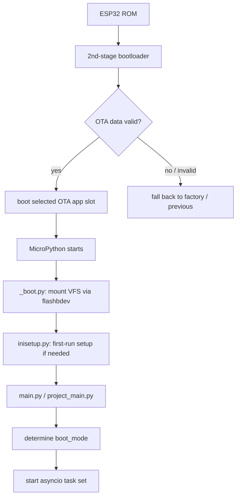

## Boot sequence

- The bootloader validates the appended image SHA-256 and the OTA-data partition,
  then jumps into the selected app slot. Failed or rolled-back updates land on the
  previous good slot (see [OTA](/subsystems/ota)).
- `_boot.py` mounts the filesystem through `flashbdev.py` (the flash block device).
- `inisetup.py` performs first-boot filesystem setup.
- `main.py` / `project_main.py` bring up the application: event bus, task manager,
  LEDs, radios, GNSS, and the compass state machine.

## Power / boot modes

`device_power.py` tracks a `boot_mode` and a battery-health state. Observed states and
transitions (from log strings):

| Concept | Values / evidence |
| --- | --- |
| Boot cause | `BOOT_POWER_ON`, `BOOT_SHUTDOWN` |
| Power mode change | `Changing power mode from {} to: {}` |
| Battery health | `Changing battery health to: {}` (`BATT_POOR_TOUCH` seen) |
| Desired boot mode | `Power Control | Desired boot_mode: {}` |
| Low-voltage cutoff | `Voltages too low, powering down | {}v` |

## Sleep

The device uses both light and deep sleep aggressively to reach the multi-hour battery
life quoted for v5.0.

<CardGroup cols={2}>
  <Card title="Light sleep" icon="moon">
    Periodic wake with duty tracking:
    `Awoke from lightsleep | Slept for: {} of {} | Total Sleep: {} | sleep duty: {:.3f}`.
    GNSS RTC sync can block sleep (`Block sleep for GNSS RTC Sync`).
  </Card>
  <Card title="Deep sleep" icon="power-off">
    State is preserved in RTC memory (`f_lib/rtc_mem.py`, `rtc_v2.py`). On wake:
    `Awake from Deep Sleep | {} | Free mem: {}`.
  </Card>
</CardGroup>

Touch sensitivity adapts to the power state — `[touch] Low battery mode ON/OFF` adjusts
the capacitive baseline so the Touch Crystal still works as the battery drains.

## Watchdog

`wdt_manager.py` manages the task watchdog. A dedicated BLE handoff watchdog
(`ble_handoff_watchdog`, `[BLE Watchdog] Handoff stall detected`) guards the peer-to-peer
comms handoff so a stalled Bluetooth owner cannot wedge the mesh.
