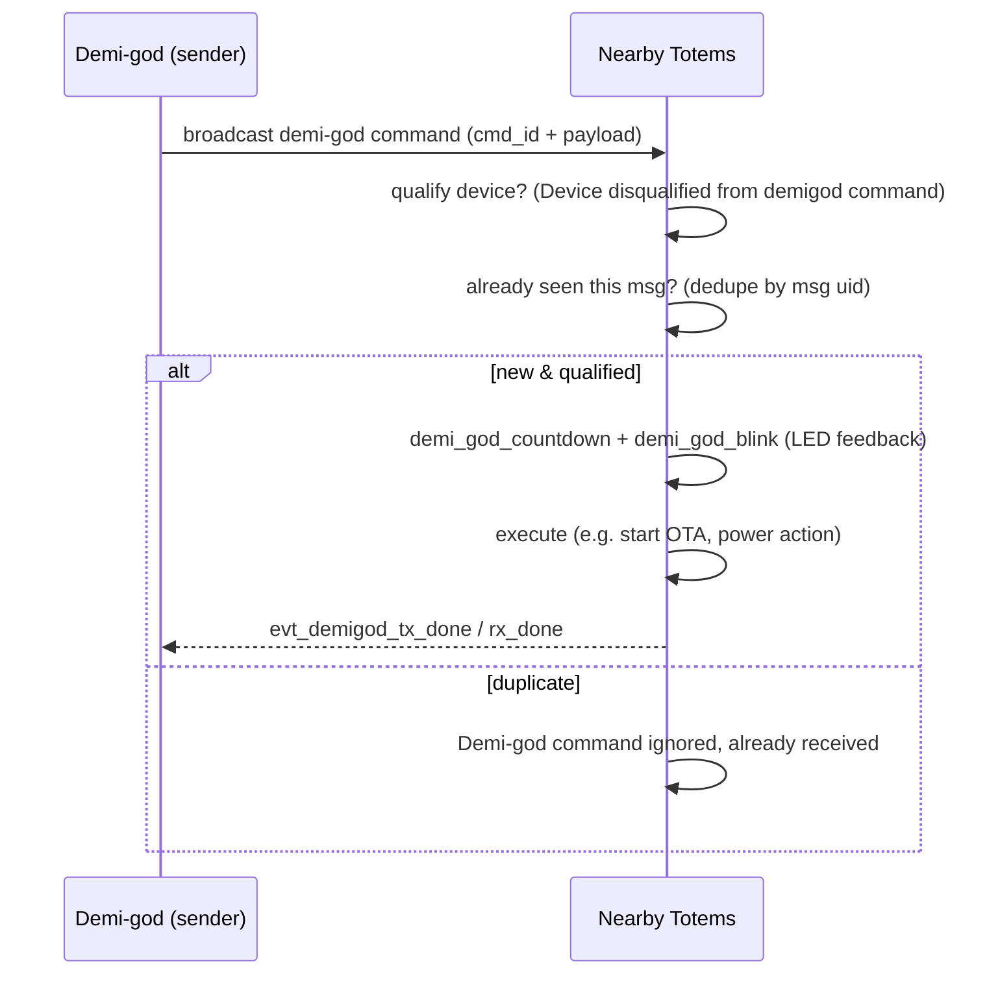

`demi_god.py` implements a **privileged broadcast command system**: a special sender
(a "demi-god") issues commands that nearby Totems act on. It rides ESP-NOW broadcast,
so it reaches every device in range without bonding — the mechanism behind
fleet operations like updating "nearby devices" at a venue.

## Command set

Each command has a generator (`demigod_gen_*`) and requires a `cmd_id`
(`A cmd_id must be provided for demi-god messages`):

| Generator | Effect |
| --- | --- |
| `demigod_gen_ota_update` | tell nearby devices to update firmware (`Demigod to update nearby devices`) |
| `demigod_gen_pwr_control` | power control (sleep / power off / mode) |
| `demigod_gen_find_device` | make a target device identify itself (locate) |
| `demigod_gen_add_nav_log_rule` | push a navigation-logging rule to devices |
| `demigod_gen_venu_code` | set a venue / event code |

## Lifecycle

| Symbol / log | Role |
| --- | --- |
| `demi_god_countdown`, `demi_god_blink` | LED countdown + blink so the user sees a command land |
| `Device disqualified from demigod command` | eligibility gate (not every device obeys every command) |
| `Demi-god command ignored, already received` | replay/duplicate suppression via message uid |
| `evt_demigod_rx_done`, `evt_demigod_tx_done` | completion events on the event bus |

## Security considerations (observations)

<Warning>
These are analyst observations from static strings, **not** verified vulnerabilities. No
device was tested.
</Warning>

- The channel is **broadcast**, which ESP-NOW does **not** encrypt
  (`Do not support encryption for multicast address`). Any authentication of demi-god
  commands must therefore be **in the application payload**, not provided by the radio.
- Commands are powerful (mass OTA, power-off, locate). The **qualification gate** and
  **replay suppression** are the visible safeguards. Whether commands are
  cryptographically authenticated (signed) is not determinable from strings alone and
  would need bytecode disassembly of `demi_god.py` to confirm.
- The `venu_code` concept suggests demi-god authority may be scoped to a venue/event
  context.

This is the single most security-relevant part of the 2.4 GHz surface and the clearest
candidate for follow-up bytecode analysis.
