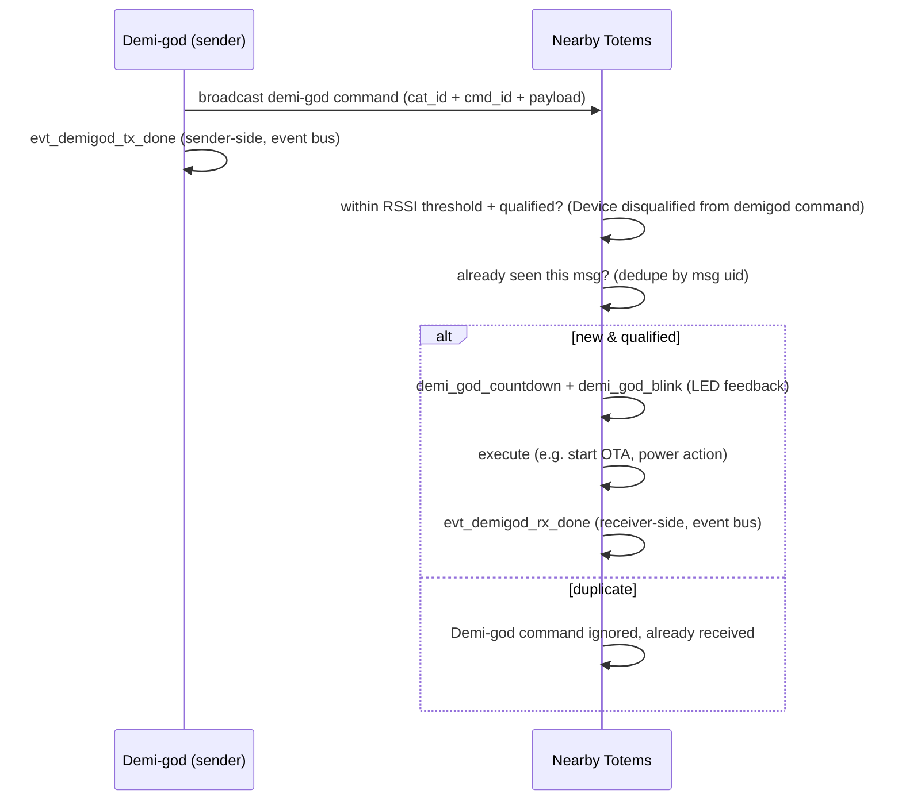

`demi_god.py` implements a **privileged broadcast command system**: a special sender
(a "demi-god") issues commands that nearby Totems act on. It rides ESP-NOW broadcast,
so it reaches every device in range without bonding — the mechanism behind
fleet operations like updating "nearby devices" at a venue.

The sender side is a designated/enabled **"demi daemon"** device role
(`is_demi_daemon`, `enable_demi_daemon`) whose send API is `demi_daemon_send` /
`send_demi_msg` — so originating these privileged commands is itself a gated device role.

## Command set

The five `demigod_gen_*` helpers wrap a generic `gen_demi_god` message builder. ESP-NOW
frames are typed by a **category** (`cat_id`) plus a **command** (`cmd_id`): demigod
occupies a category, and each generator sets a specific `cmd_id`. Every message requires a
command id (`A cmd_id must be provided for demi-god messages`). The numeric `cat_id` /
`cmd_id` values are frozen-bytecode constants and are **not determinable** from strings.

| Generator | Effect |
| --- | --- |
| `demigod_gen_ota_update` | tell nearby devices to update firmware (`Demigod to update nearby devices`) |
| `demigod_gen_pwr_control` | power control: power off (`send_pwr_off_cmd`, `Sending demigod command to power down`), reboot (`device_reboot`), or power-mode change (`Changing power mode from {} to: {}`) |
| `demigod_gen_find_device` | make a target device identify itself (locate) |
| `demigod_gen_add_nav_log_rule` | push a navigation-logging rule to devices |
| `demigod_gen_venu_code` | set a venue / event code |

## Lifecycle

| Symbol / log | Role |
| --- | --- |
| `demi_god_countdown`, `demi_god_blink` | LED countdown + blink so the user sees a command land |
| `Device disqualified from demigod command` | qualification/eligibility gate; (inferred) keyed on RSSI proximity — a device acts on / adopts a command only when the sender is within an RSSI threshold (`Venue Code Skipped, RSSI outside threshold: {} to {}`, `Mesh skipped, RSSI outside threshold: {} to {}`; qstrs `PEER_CHECK_RSSI`, `closest_rssi`), which also bounds which nearby devices a command can affect |
| `Demi-god command ignored, already received` | replay/duplicate suppression via message uid |
| `evt_demigod_tx_done`, `evt_demigod_rx_done` | **local** completion events on the event bus — `evt_demigod_tx_done` fires sender-side, `evt_demigod_rx_done` receiver-side (not a network ack/reply) |

## Security considerations (observations)

<Warning>
These are analyst observations from static strings, **not** verified vulnerabilities. No
device was tested.
</Warning>

- The channel is **broadcast**, which ESP-NOW does **not** encrypt
  (`Do not support encryption for multicast address`). Any authentication of demi-god
  commands must therefore be **in the application payload**, not provided by the radio.
- Commands are powerful (mass OTA, power-off, locate). The only message validation
  evidenced is a fixed **SyncWord + length** check
  (`Invalid ESP-NOW message SyncWord or length`) plus a **non-cryptographic checksum/CRC**
  (`Invalid Checksum value for: {}`,
  qstrs `crc32` / `crc8`) — a SyncWord is a public framing marker, not a secret. An
  exhaustive negative search found **no** signature / HMAC / nonce / challenge / token
  string tied to demigod or the ESP-NOW app path (the only such strings belong to the
  TLS/mbedTLS stack, BLE bonding, and the WiFi driver). So the string/symbol evidence
  indicates demi-god commands are **unauthenticated at the application layer**; the
  RSSI-proximity gate and replay suppression are the visible safeguards, and neither
  authenticates the sender. The exact wire layout would still need bytecode/const-table
  decode to fully confirm.
- The `venu_code` command distributes a plaintext grouping/identifier value to co-located
  devices (adopted only when the sender is within the RSSI threshold —
  `Venue Code Skipped, RSSI outside threshold: {} to {}`), used to scope subsequent mesh / smart-group behavior.
  It is a **grouping token, not a credential** — it carries no key material and does not
  authenticate demi-god authority.

This is the single most security-relevant part of the 2.4 GHz surface and the clearest
candidate for follow-up bytecode analysis.
