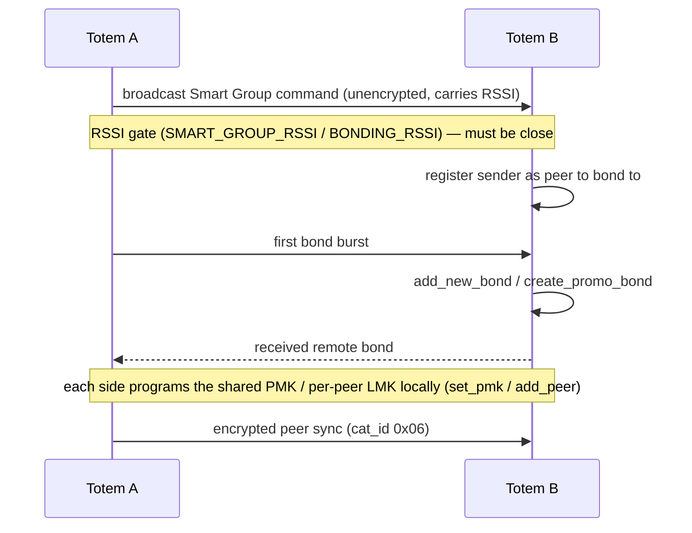

The **Unity Mesh Network** is Totem-to-Totem communication built on **ESP-NOW** —
Espressif's connectionless 2.4 GHz protocol that sends frames directly to a peer MAC
without an access point. Implemented in `espnow.py`, `espnow_conn_v2.py`,
`espnow_msg.py`, `aioespnow.py`, and the `peer_*` modules.

## Why ESP-NOW

- **No infrastructure**: works anywhere, no WiFi network or internet.
- **Low latency, low power**: short frames, radio can sleep between them.
- **Direct + broadcast**: unicast to a bonded peer, or broadcast for discovery and
  [demi-god](/protocols/demigod) commands.

## Channel

The mesh operates on a fixed **home channel**. A peer on a different channel is
rejected outright:

```text
Peer channel is not equal to the home channel, send fail!
Peer channel is not support, need to change channel
```

WiFi and BLE coexist with the mesh on this one radio — the firmware exposes combined
run-modes (`MODE_ESP_NOW_WIFI`, `MODE_ESP_NOW_WIFI_BLE`) so ESP-NOW runs alongside them
rather than being switched off. Because every peer must stay on the shared home channel,
any WiFi activity that retunes the radio to another channel (for example a WiFi firmware
download) would interrupt mesh delivery until the radio returns to the home channel.

## Long-range mode

The build supports ESP-NOW **long-range PHY rates** (`WIFI_PHY_RATE_LORA_250K`,
`WIFI_PHY_RATE_LORA_500K`), trading throughput for range — useful across a large venue.

## Peers & bonding

"Bonding" here is a **Totem-to-Totem** relationship (distinct from BLE bonding with the
phone). A bonded set of Totems is a friend group that syncs positions and messages.

| Concept | Symbols / logs |
| --- | --- |
| Peer registry | `active_nodes`, `add_new_bond`, `peer_management.py` |
| Auto-bond | `Autobonding to Peers`, `auto_bond_timeout`, `auto_bond_client_timeout`, `Abandoning auto-bond group` |
| Promo bond | `[create_promo_bond] Created Bond!`, `Peer already exists` |
| Re-bond | `Already a Peer, allow re-bonding` |
| Proximity gate | `BONDING`, `BONDING_RSSI` (bond only when close enough) |
| Blacklist | `_PEER_BLACKLIST` |
| Settle time | `CONN_SETTLE_MS` |
| Limits | peer table capped by `MAX_TOTAL_PEER_NUM` / `MAX_ENCRYPT_PEER_NUM` (`Max ESP-NOW peers reached`); bonds capped by `max_bonds` (`Cannot have more than {} bonds`) — enforced, numeric values live in frozen bytecode (undetermined) |

Bonding events drive LED animations: `anim_add_peer`, `anim_bonding_ctdwn`
(countdown), `anim_peer_del_ctdwn`, `add_peer_animation`.

### Smart Group (auto-bond join)

Auto-bonding uses a broadcast **Smart Group** join protocol. A host broadcasts a Smart
Group command that carries the sender's RSSI; a receiver within `SMART_GROUP_RSSI`
registers the sender as a peer to bond to, then the two sides exchange bond bursts.
Confirmed strings from the send/receive path:

```text
Generating Smart Group msg | inst: {} | timeout: {} | UID: {}
Sent Smart Group join cmd
Received Smart Group Command: {} | Rssi: {} | {}
Register sender as peer to bond to
Sending first bond burst
Received remote bond
```

Wrong-group joins are ignored (`Incorrect auto-bond group, ignore request`). Broadcast
discovery itself rides `gen_public_chirp` / `advertise_burst` (`Created public chirp`).

### Bonding flow



## Encryption

Unicast peer traffic can be **encrypted** with ESP-NOW's PMK/LMK link encryption.
Evidence from the IDF layer: `PMK is NULL`, `set lmk fail`, `Encrypt peer is full`,
`Encryption Failed`, and `Do not support encryption for multicast address`. That last
rule — the IDF forbidding encryption of multicast/broadcast frames — **confirms
broadcast is unencrypted**. That **bonded unicast is encrypted** is a strong inference,
not a proven fact: a PMK is programmed (`set_pmk`) and `MAX_ENCRYPT_PEER_NUM` is distinct
from `MAX_TOTAL_PEER_NUM`, implying a mix of encrypted and unencrypted peers. Whether
every unicast is encrypted or only bonded-peer unicast is not determined by this
firmware.

<Warning>
ESP-NOW encryption uses a 16-byte PMK plus per-peer LMKs. The keys themselves are
derived/stored in bytecode and NVS and were not extracted. Broadcast frames (discovery,
demi-god) are not encrypted by ESP-NOW; any application-layer protection on them is in
the message payload.
</Warning>

## Peer sync & relay

Once bonded, Totems exchange **Peer Sync** messages — `(0x06, 0x07)` — plus **Peer
Ping** liveness. Delivery is buffered and relayed:

| Symbol | Role |
| --- | --- |
| `enqueue_peer_outbox`, `add_peers_to_outbox` | queue outbound peer messages |
| `_send_outbox` | drain the outbox |
| `_relay_frame` | forward a frame to extend range (multi-hop) |
| `cal_mesh_delivery`, `compass_mesh`, `ENOW_MESH_BUFF`, `MESH_BUFF_SIZE` | mesh delivery + buffering |
| `MESH_PEER_MSG_LIMIT`, `gen_msg_uid`, `MSG_EXP_MSECS` | flood control + de-dupe (see [message format](/protocols/message-format)) |

Peer updates can also be pushed to the phone: `Adding Peer: {} to BLE outbox`, and are
ACKed as `BLE ACK Peer Sync` / `BLE ACK Peer Ping`.

### Relay & multi-hop

The Unity Mesh is a **flooding mesh with slotted relay suppression**, not tree routing.
A node re-broadcasts frames it hears (`_relay_frame`) up to `max_hops`, gated by RSSI
distance so it relays for distant peers and suppresses for near ones (`MESH_MIN_HOP_RANGE`,
`MESH_RELAY_MIN_DIST`). Before relaying it waits a randomized slot delay
(`MESH_SLOTS_PER_NODE`, `rand_tail`, `tail_expire_sec`); if it hears another node relay
first it backs off instead of duplicating:

```text
Relay honored by another device. Waiting: {}ms before re-using mesh to find Peer
Node Slots disabled, relaying all (too few nearby nodes)
```

When too few nodes are nearby, slotting is disabled and every frame is relayed. Origin
and relay state is tracked per frame (`origin_mesh`, `originator`, `mesh_honored`,
`mesh_relayed`). The numeric tunables (`max_hops`, `MESH_SLOTS_PER_NODE`,
`MESH_MIN_HOP_RANGE`, `MESH_RELAY_MIN_DIST`) live in frozen bytecode and are undetermined.

## What rides the mesh

- **Positions & headings** of bonded friends (for the "navigate to friend" feature).
- **Chat messages** (`chat_msg.py`, `chat_inbox_unread`).
- **Peer bond details** (`Downloading Peer Details`).
- **Demi-god broadcast commands** (see next page).
- **Nav-log rules** distributed via demi-god broadcast (`demigod_gen_add_nav_log_rule`).
- **RTC / time-of-day sync** — nodes distribute the clock over the mesh (`RTC set via Peer's itod`, `gen_peer_sync`).
