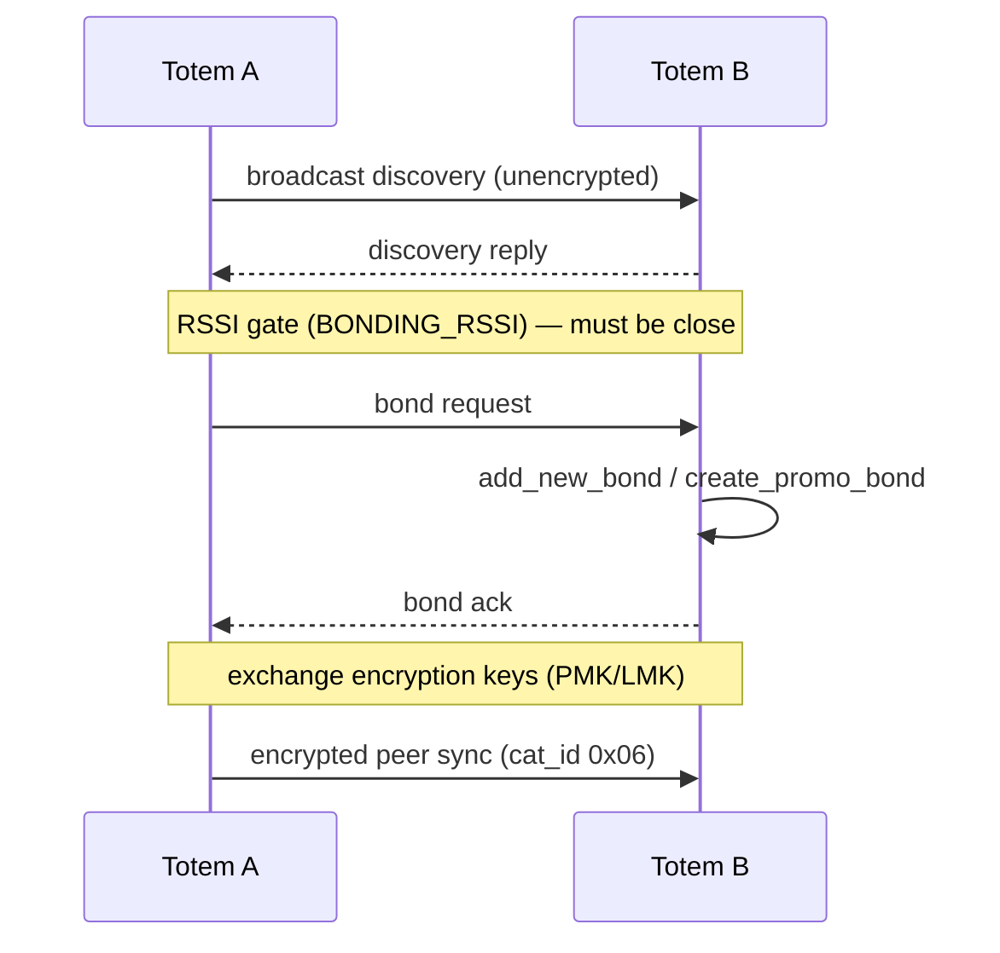

The **Unity Mesh Network** is Totem-to-Totem communication built on **ESP-NOW** —
Espressif's connectionless 2.4 GHz protocol that sends frames directly to a peer MAC
without an access point. Implemented in `espnow.py`, `espnow_conn_v2.py`,
`espnow_msg.py`, `aioespnow.py`, and the `peer_*` modules.

## Why ESP-NOW

- **No infrastructure**: works anywhere, no WiFi network or internet.
- **Low latency, low power**: short frames, radio can sleep between them.
- **Direct + broadcast**: unicast to a bonded peer, or broadcast for discovery and
  [demi-god](/protocols/demigod) commands.

## Channel

The mesh operates on a fixed **home channel**. A peer on a different channel is
rejected outright:

```text
Peer channel is not equal to the home channel, send fail!
Peer channel is not support, need to change channel
```

WiFi/BT coexistence shares this one radio, so during a hotspot OTA (station mode on the
phone's channel) mesh traffic is suspended.

## Long-range mode

The build supports ESP-NOW **long-range PHY rates** (`WIFI_PHY_RATE_LORA_250K`,
`WIFI_PHY_RATE_LORA_500K`), trading throughput for range — useful across a large venue.

## Peers & bonding

"Bonding" here is a **Totem-to-Totem** relationship (distinct from BLE bonding with the
phone). A bonded set of Totems is a friend group that syncs positions and messages.

| Concept | Symbols / logs |
| --- | --- |
| Peer registry | `active_nodes`, `add_new_bond`, `peer_management.py` |
| Auto-bond | `Autobonding to Peers`, `auto_bond_timeout`, `auto_bond_client_timeout`, `Abandoning auto-bond group` |
| Promo bond | `[create_promo_bond] Created Bond!`, `Peer already exists` |
| Re-bond | `Already a Peer, allow re-bonding` |
| Proximity gate | `BONDING`, `BONDING_RSSI` (bond only when close enough) |
| Blacklist | `_PEER_BLACKLIST` |
| Settle time | `CONN_SETTLE_MS` |

Bonding events drive LED animations: `anim_add_peer`, `anim_bonding_ctdwn`
(countdown), `anim_peer_del_ctdwn`, `add_peer_animation`.

### Bonding flow



## Encryption

Unicast peer traffic can be **encrypted** with ESP-NOW's PMK/LMK scheme (AES-CCM in the
radio). Evidence from the IDF layer: `PMK is NULL`, `set lmk fail`, `Encrypt peer is
full`, `Encryption Failed`, and `Do not support encryption for multicast address` —
confirming that **broadcast/discovery is unencrypted** while **bonded unicast is
encrypted**.

<Warning>
ESP-NOW encryption uses a 16-byte PMK plus per-peer LMKs. The keys themselves are
derived/stored in bytecode and NVS and were not extracted. Broadcast frames (discovery,
demi-god) are not encrypted by ESP-NOW; any application-layer protection on them is in
the message payload.
</Warning>

## Peer sync & relay

Once bonded, Totems exchange **Peer Sync** messages — `(0x06, 0x07)` — plus **Peer
Ping** liveness. Delivery is buffered and relayed:

| Symbol | Role |
| --- | --- |
| `enqueue_peer_outbox`, `add_peers_to_outbox` | queue outbound peer messages |
| `_send_outbox` | drain the outbox |
| `_relay_frame` | forward a frame to extend range (multi-hop) |
| `cal_mesh_delivery`, `compass_mesh`, `ENOW_MESH_BUFF`, `MESH_BUFF_SIZE` | mesh delivery + buffering |
| `MESH_PEER_MSG_LIMIT`, `gen_msg_uid`, `MSG_EXP_MSECS` | flood control + de-dupe (see [message format](/protocols/message-format)) |

Peer updates can also be pushed to the phone: `Adding Peer: {} to BLE outbox`, and are
ACKed as `BLE ACK Peer Sync` / `BLE ACK Peer Ping`.

## What rides the mesh

- **Positions & headings** of bonded friends (for the "navigate to friend" feature).
- **Chat messages** (`chat_msg.py`, `chat_inbox_unread`).
- **Peer bond details** (`Downloading Peer Details`).
- **Demi-god broadcast commands** (see next page).
- **Calibration/nav-log rules** distributed across the group.
