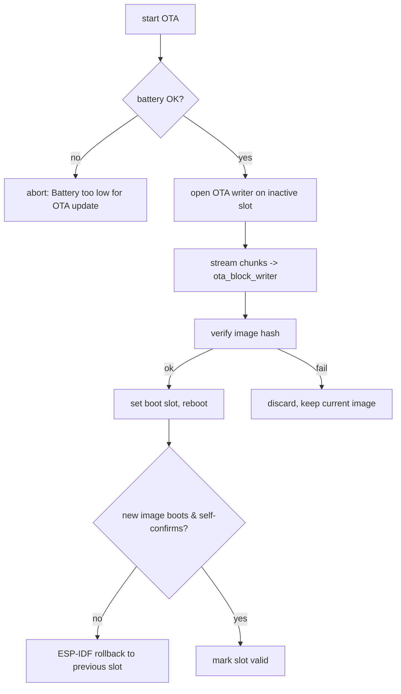

Updates are handled by the `f_ota/` package and `f_lib/firmware_*` modules, with two
delivery transports (BLE and WiFi) feeding one install path. On current firmware the
WiFi path runs over station WiFi — `OTA Hotspot has been sunset` — with the hotspot
join kept only as a legacy path for older firmware.

## Delivery paths

<CardGroup cols={2}>
  <Card title="Via app (BLE)" icon="bluetooth">
    The image streams over the chunked GATT transport
    (`ota_ble.py`, `svc_ble_transfer.py`): `Connected to OTA BLE`, `cb_start_ota`.
  </Card>
  <Card title="Via WiFi" icon="wifi">
    Current WiFi OTA runs over station WiFi: the release is resolved via
    `http://api.totemportal.com`, the package is fetched from datapeak S3, and the
    update is command-triggered over a WebSocket channel. The legacy hotspot path
    (`OTA Hotspot has been sunset`) — triple *tap* SOS (capacitive `TouchButtonV2`;
    the SOS→OTA-trigger binding is inferred from symbol adjacency, not string-provable),
    join `totemupdate`, download over HTTP — remains only for older firmware. See
    [WiFi OTA](/protocols/wifi-ota).
  </Card>
</CardGroup>

A [demi-god](/protocols/demigod) broadcast (`demigod_gen_ota_update`) can also tell a
group of nearby devices to update at once.

## Package formats

The updater accepts two package types, one per **update method** — firmware vs
preview — selected by the `update method` field
(`Getting release details | update method: {} | endpoint_id: {} | version: {}`):

| Format | Method | Handling |
| --- | --- | --- |
| `.bin` | Firmware | a raw ESP-IDF app image written directly to the OTA slot (`Performing Firmware update via WiFi`, `install_firmware_update`, `from_firmware_file`) |
| `.tgz` | Preview | gzip + tar assets/content bundle, unpacked on-device (`f_lib/gzip.py`, `f_lib/tarfile.py`, `f_lib/unpack.py`) — carries assets/content, **not** the app image (`Performing Preview update via WiFi`, `install_preview`) |

If the expected package is absent the update aborts cleanly:
`.tgz package not found in repo, cannot perform OTA`,
`.bin package not found in repo, cannot perform OTA`.

A manifest/index (`content.json`, `Downloading content.json`) describes what to fetch;
assets and preferences can be pulled alongside (`Download Compass Preferences`,
`Download Developer Options`, `Downloaded preview`).

## Install flow



| Stage | Modules / evidence |
| --- | --- |
| Battery gate | `Battery too low for OTA update` (exact voltage/percent threshold lives in frozen bytecode — not recoverable from strings) |
| Block write | `ota_block_writer.py`, `BlockDevWriter`, `download_size`, `downloaded_bytes` |
| Progress | `Downloaded: {} of {} bytes | {}% complete` |
| Callbacks | `ota_callback.py`, `ota_daemon.py`, `cb_start_ota`, `close_ota`, `Closing OTA writer` |
| Clean exit | `Cleanly exiting OTA` |
| Status/error types | `OtaStatus`, `OtaErr`, `OTA_ACTIVE`, `OTA_MAX`, `OTA_MIN` (symbols only — numeric values not recoverable from strings) |

## Rollback & slot management

The image uses the standard **ESP-IDF OTA data** partition with two app slots plus a
factory image. `f_lib/firmware_rollback.py` drives recovery:

```text
ota data invalid, no current app. Assuming factory
not found otadata
Rollback is not possible, do not have any suitable apps in slots
Running firmware is factory
```

Rollback is partly app-driven: `mark_app_valid_cancel_rollback` confirms a good image
(cancelling the IDF anti-rollback watchdog), while `Manually rolling back firmware` and
`OTA rollback unsupported` point to an app-level manual rollback path alongside the IDF
partition mechanism. A failed or non-self-confirming update reverts to the previous good
slot. The "orange blink" failure indicator is described in the user-facing update guide;
no firmware string binds an orange blink specifically to OTA failure or rollback.

## Integrity

- The update path verifies a **SHA-256 digest** of the downloaded image at the app level:
  `File integrity confirmed!` on match, `SHA256 hash does NOT match` on mismatch
  (`SHA256 final : {}`, `SHA256 origin: {}`; qstrs `sha256_expected`, `sha256_feed`,
  `sha256_hash`). The expected hash is carried in the release/`content.json` metadata
  fetched over HTTP — so integrity rests on that digest, not on transport security.
- The ESP-IDF bootloader additionally checks the app image hash at boot
  (`Image hash failed - image is corrupt`). This is the stock ESP-IDF image-integrity
  default; it is inferred rather than shown to be wired to the app's OTA writer.
- `ECDSA with SHA256` / `ECP_VERIFY_FAILED` machinery is present (mbedTLS). Whether the
  OTA install additionally verifies an ECDSA **signature** over the package — versus
  relying on the image hash plus rollback — is not determinable from strings alone and
  is a candidate for bytecode analysis of `f_ota/install_ota.py`.

<Warning>
The download itself was observed over **HTTP** (not HTTPS). Update integrity therefore
relies on image-level verification and rollback rather than transport security. See
[WiFi OTA](/protocols/wifi-ota).
</Warning>
