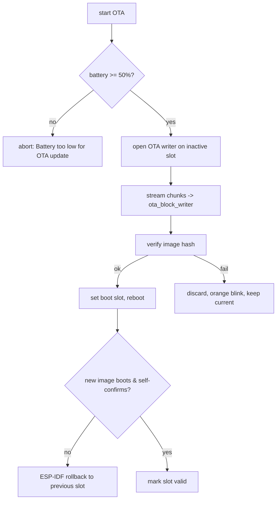

Updates are handled by the `f_ota/` package and `f_lib/firmware_*` modules, with two
delivery transports (BLE and WiFi hotspot) feeding one install path.

## Delivery paths

<CardGroup cols={2}>
  <Card title="Via app (BLE)" icon="bluetooth">
    The default path on v4.2+. The image streams over the chunked GATT transport
    (`ota_ble.py`, `svc_ble_transfer.py`): `Connected to OTA BLE`, `cb_start_ota`.
  </Card>
  <Card title="Via hotspot (WiFi)" icon="wifi">
    Fallback for older firmware. Triple-click SOS, join `totemupdate`, download over
    HTTP. See [WiFi OTA](/protocols/wifi-ota).
  </Card>
</CardGroup>

A [demi-god](/protocols/demigod) broadcast (`demigod_gen_ota_update`) can also tell a
group of nearby devices to update at once.

## Package formats

The updater accepts two package types, fetched from the device's release repo:

| Format | Handling |
| --- | --- |
| `.tgz` | gzip + tar, unpacked on-device (`f_lib/gzip.py`, `f_lib/tarfile.py`, `f_lib/unpack.py`) — carries app + assets |
| `.bin` | a raw ESP-IDF app image written directly to the OTA slot |

If the expected package is absent the update aborts cleanly:
`.tgz package not found in repo, cannot perform OTA`,
`.bin package not found in repo, cannot perform OTA`.

A manifest/index (`content.json`, `Downloading content.json`) describes what to fetch;
assets and preferences can be pulled alongside (`Download Compass Preferences`,
`Download Developer Options`, `Downloaded preview`).

## Install flow



| Stage | Modules / evidence |
| --- | --- |
| Battery gate | `Battery too low for OTA update` |
| Block write | `ota_block_writer.py`, `BlockDevWriter`, `download_size`, `downloaded_bytes` |
| Progress | `Downloaded: {} of {} bytes | {}% complete` |
| Callbacks | `ota_callback.py`, `ota_daemon.py`, `cb_start_ota`, `close_ota`, `Closing OTA writer` |
| Clean exit | `Cleanly exiting OTA` |
| Result codes | `1=done 2=no app 3=retry 4=failed 5=cancel 6=abort` |

## Rollback & slot management

The image uses the standard **ESP-IDF OTA data** partition with two app slots plus a
factory image. `f_lib/firmware_rollback.py` drives recovery:

```text
ota data invalid, no current app. Assuming factory
not found otadata
Rollback is not possible, do not have any suitable apps in slots
Running firmware is factory
```

A failed or non-self-confirming update reverts to the previous good slot — the orange
blink behavior in the update guide.

## Integrity

- The bootloader validates the **appended SHA-256** of the app image before boot.
- `ECDSA with SHA256` / `ECP_VERIFY_FAILED` machinery is present (mbedTLS). Whether the
  OTA install additionally verifies an ECDSA **signature** over the package — versus
  relying on the image hash plus rollback — is not determinable from strings alone and
  is a candidate for bytecode analysis of `f_ota/install_ota.py`.

<Warning>
The download itself was observed over **HTTP** (not HTTPS). Update integrity therefore
relies on image-level verification and rollback rather than transport security. See
[WiFi OTA](/protocols/wifi-ota).
</Warning>
